<h1> TFRecord_USA_RoadSigns </h1>
This is a TFRecord dataset of USA_RoadSigns derived from <a href="https://github.com/sarah-antillia/YOLO_USA_RoadSigns">YOLO_USA_RoadSigns</a>.

 

 
<h2>Images of Base USA RoadSigns</h2>
Taken from <a href="https://en.wikipedia.org/wiki/Road_signs_in_the_United_States">Road signs in the United States.</a>.
 

<table>
<tr>
<td>  270_degree_loop</td>
<td>  Added_lane</td>
<td>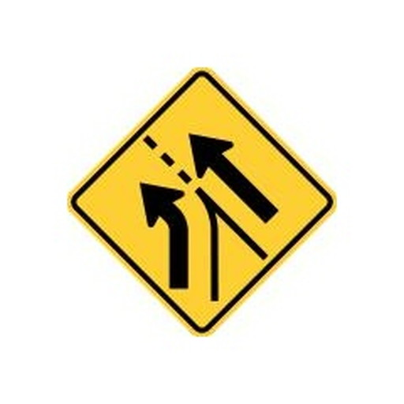  Added_lane_from_entering_roadway</td>
</tr>
<tr>
<td>  All_way</td>
<td>  Be_prepared_to_stop</td>
<td>  Bicycles</td>
</tr>
<tr>
<td>  Bicycles_and_pedestrians</td>
<td>  Bicycles_left_pedestrians_right</td>
<td>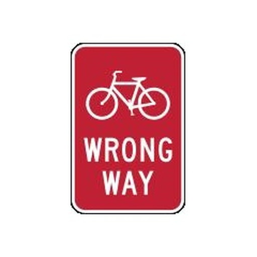  Bicycle_wrong_way</td>
</tr>
<tr>
<td>  Bike_lane</td>
<td>  Bike_lane_slippery_when_wet</td>
<td>  Bump</td>
</tr>
<tr>
<td>  Bus_lane</td>
<td>  Center_lane</td>
<td>  Chevron_alignment</td>
</tr>
<tr>
<td>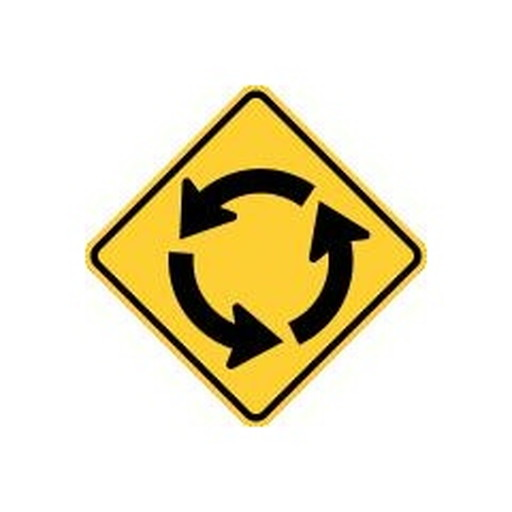  Circular_intersection_warning</td>
<td>  Cross_roads</td>
<td>  Curve</td>
</tr>
<tr>
<td>  Dead_end</td>
<td>  Deer_crossing</td>
<td>  Detour</td>
</tr>
<tr>
<td>  Detour_right</td>
<td>  Dip</td>
<td>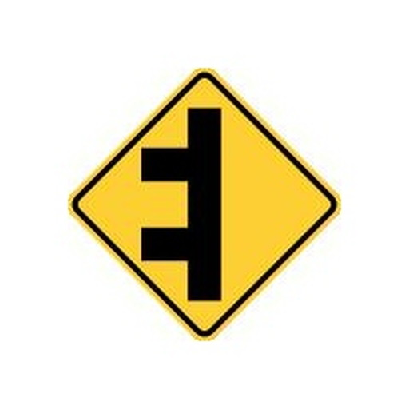  Double_side_roads</td>
</tr>
<tr>
<td>  Do_not_drive_on_tracks</td>
<td>  Do_not_enter</td>
<td>  Do_not_pass_stopped_trains</td>
</tr>
<tr>
<td>  Emergency_signal</td>
<td>  End_detour</td>
<td>  Except_right_turn</td>
</tr>
<tr>
<td>  Fallen_rocks</td>
<td>  Flagger_present</td>
<td>  Fog_area</td>
</tr>
<tr>
<td>  Golf_cart_crossing</td>
<td>  Go_on_slow</td>
<td>  Gusty_winds_area</td>
</tr>
<tr>
<td>  Hairpin_curve</td>
<td>  Hazardous_material_prohibited</td>
<td>  Hazardous_material_route</td>
</tr>
<tr>
<td>  Hidden_driveway</td>
<td>  Hill_bicycle</td>
<td>  Horizontal_alignment_intersection</td>
</tr>
<tr>
<td>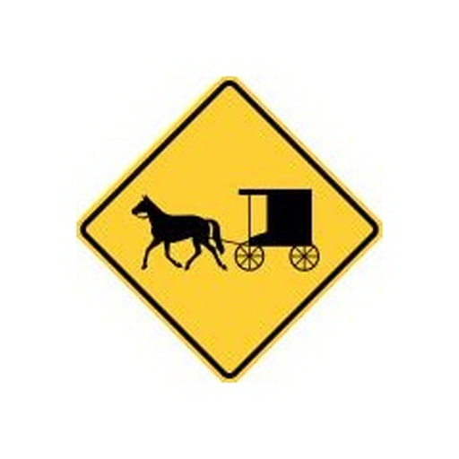  Horse_drawn_vehicle_ahead</td>
<td>  Keep_left</td>
<td>  Keep_left_2</td>
</tr>
<tr>
<td>  Keep_right</td>
<td>  Keep_right_2</td>
<td>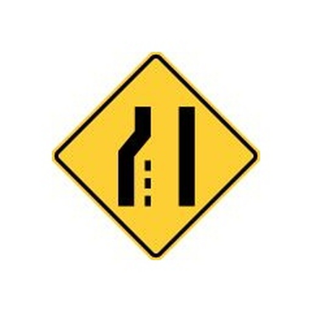  Lane_ends</td>
</tr>
<tr>
<td>  Left_lane</td>
<td>  Left_turn_only</td>
<td>  Left_turn_or_straight</td>
</tr>
<tr>
<td>  Left_turn_yield_on_green</td>
<td>  Loading_zone</td>
<td>  Low_clearance</td>
</tr>
<tr>
<td>  Low_ground_clearance_railroad_crossing</td>
<td>  Merge</td>
<td>  Merging_traffic</td>
</tr>
<tr>
<td>  Metric_low_clearance</td>
<td>  Minimum_speed_limit_40</td>
<td>  Minimum_speed_limit_60km</td>
</tr>
<tr>
<td>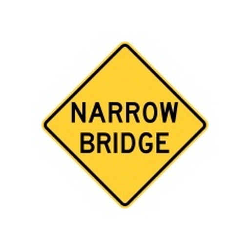  Narrow_bridge</td>
<td>  National_network_prohibited</td>
<td>  National_network_route</td>
</tr>
<tr>
<td>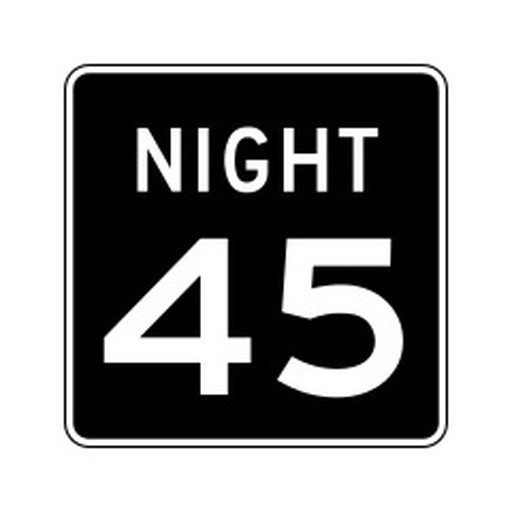  Night_speed_limit_45</td>
<td>  Night_speed_limit_70km</td>
<td>  No_bicycles</td>
</tr>
<tr>
<td>  No_entre</td>
<td>  No_hitch_hiking</td>
<td>  No_horseback_riding</td>
</tr>
<tr>
<td>  No_large_trucks</td>
<td>  No_left_or_u_turn</td>
<td>  No_left_turn</td>
</tr>
<tr>
<td>  No_left_turn_across_tracks</td>
<td>  No_outlet</td>
<td>  No_parking</td>
</tr>
<tr>
<td>  No_parking_bus_stop</td>
<td>  No_parking_from_830am_to_530pm</td>
<td>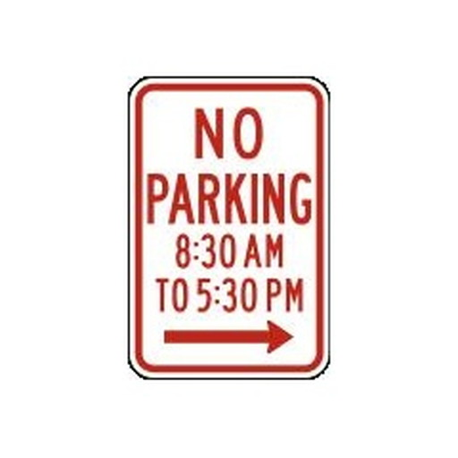  No_parking_from_830am_to_530pm_2</td>
</tr>
<tr>
<td>  No_parking_in_fire_lane</td>
<td>  No_parking_Loading_zone</td>
<td>  No_parking_on_pavement</td>
</tr>
<tr>
<td>  No_pedestrians</td>
<td>  No_pedestrian_crossing</td>
<td>  No_right_turn</td>
</tr>
<tr>
<td>  No_rollerblading</td>
<td>  No_standing_any_time</td>
<td>  No_stopping_on_pavement</td>
</tr>
<tr>
<td>  No_straight_through</td>
<td>  No_train_horn_warning</td>
<td>  No_turns</td>
</tr>
<tr>
<td>  No_unauthorized_vehicles</td>
<td>  No_u_turn</td>
<td>  Offset_roads</td>
</tr>
<tr>
<td>  One_direction</td>
<td>  One_way</td>
<td>  Parking_with_time_restrictions</td>
</tr>
<tr>
<td>  Pass_on_either_side</td>
<td>  Pass_road</td>
<td>  Path_narrows</td>
</tr>
<tr>
<td>  Pedestrian_crossing</td>
<td>  Railroad_crossing</td>
<td>  Railroad_crossing_ahead</td>
</tr>
<tr>
<td>  Railroad_intersection_warning</td>
<td>  Ramp_narrows</td>
<td>  Reserved_parking_wheelchair</td>
</tr>
<tr>
<td>  Reverse_curve</td>
<td>  Reverse_turn</td>
<td>  Right_lane</td>
</tr>
<tr>
<td>  Right_turn_only</td>
<td>  Right_turn_or_straight</td>
<td>  Road_closed</td>
</tr>
<tr>
<td>  Road_closed_ahead</td>
<td>  Road_narrows</td>
<td>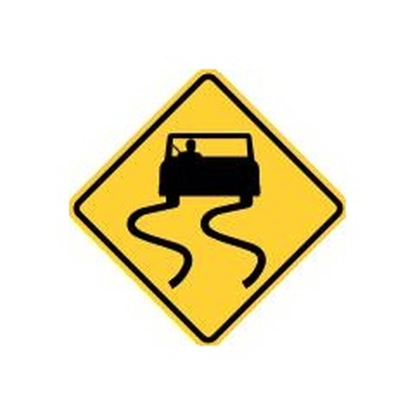  Road_slippery_when_wet</td>
</tr>
<tr>
<td>  Rough_road</td>
<td>  Runaway_vehicles_only</td>
<td>  School</td>
</tr>
<tr>
<td>  School_advance</td>
<td>  School_bus_stop_ahead</td>
<td>  School_bus_turn_ahead</td>
</tr>
<tr>
<td>  School_speed_limit_ahead</td>
<td>  Sharp_turn</td>
<td>  Side_road_at_an_acute_angle</td>
</tr>
<tr>
<td>  Side_road_at_a_perpendicular_angle</td>
<td>  Single_lane_shift_left</td>
<td>  Skewed_railroad_crossing</td>
</tr>
<tr>
<td>  Snowmobile</td>
<td>  Speed_limit_50</td>
<td>  Speed_limit_80km</td>
</tr>
<tr>
<td>  Stay_in_lane</td>
<td>  Steep_grade</td>
<td>  Steep_grade_percentage</td>
</tr>
<tr>
<td>  Stop</td>
<td>  Stop_here_for_pedestrians</td>
<td>  Stop_here_for_peds</td>
</tr>
<tr>
<td>  Straight_ahead_only</td>
<td>  Tractor_farm_vehicle_crossing</td>
<td>  Tractor_farm_vehicle_crossing_2</td>
</tr>
<tr>
<td>  Truck_crossing</td>
<td>  Truck_crossing_2</td>
<td>  Truck_rollover_warning</td>
</tr>
<tr>
<td>  Truck_route_sign</td>
<td>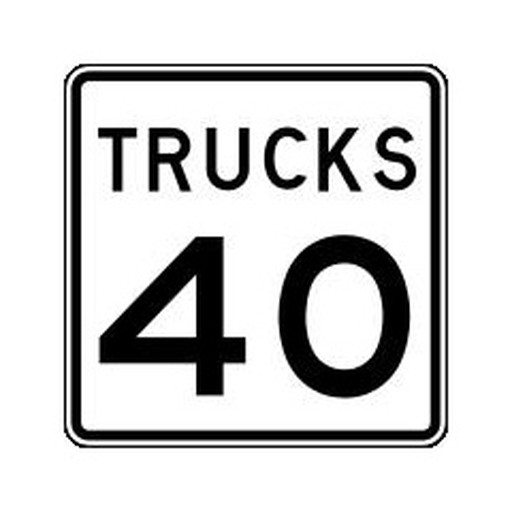  Truck_speed_Limit_40</td>
<td>  Turning_vehicles_yield_to_pedestrians</td>
</tr>
<tr>
<td>  Turn_only_lanes</td>
<td>  Two_direction</td>
<td>  Two_way_traffic</td>
</tr>
<tr>
<td>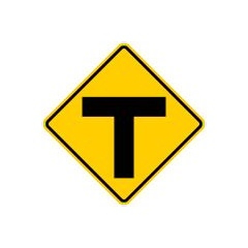  T_roads</td>
<td>  Wait_on_stop</td>
<td>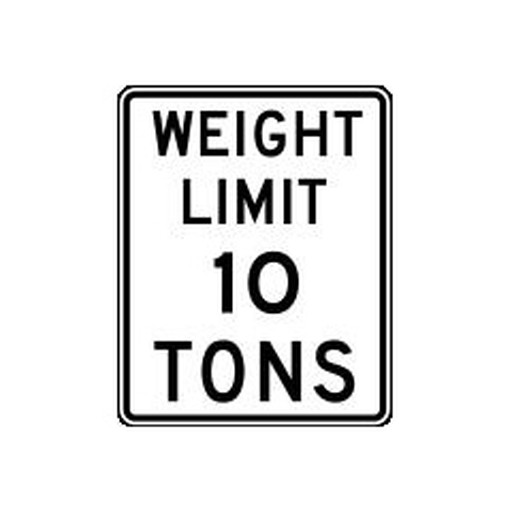  Weight_limit_10t</td>
</tr>
<tr>
<td>  Winding_road</td>
<td>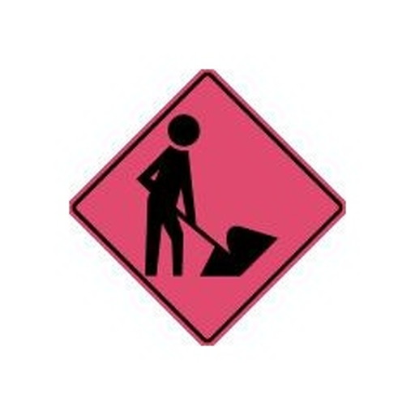  Workers_on_road</td>
<td>  Work_zone_for_speed_limit</td>
</tr>
<tr>
<td>  Wrong_way</td>
<td>  Yield</td>
<td>  Yield_here_to_pedestrians</td>
</tr>
<tr>
<td>  Yield_here_to_peds</td>
<td>  Y_roads</td>
</tr>
</table>

 
<h2>label_map.pbtxt</h2>
<pre>
item {
  display_name: '270_degree_loop'
  id: 1
  name: '270_degree_loop'
}
item {
  display_name: 'Added_lane'
  id: 2
  name: 'Added_lane'
}
item {
  display_name: 'Added_lane_from_entering_roadway'
  id: 3
  name: 'Added_lane_from_entering_roadway'
}
item {
  display_name: 'All_way'
  id: 4
  name: 'All_way'
}
item {
  display_name: 'Be_prepared_to_stop'
  id: 5
  name: 'Be_prepared_to_stop'
}
item {
  display_name: 'Bicycles'
  id: 6
  name: 'Bicycles'
}
item {
  display_name: 'Bicycles_and_pedestrians'
  id: 7
  name: 'Bicycles_and_pedestrians'
}
item {
  display_name: 'Bicycles_left_pedestrians_right'
  id: 8
  name: 'Bicycles_left_pedestrians_right'
}
item {
  display_name: 'Bicycle_wrong_way'
  id: 9
  name: 'Bicycle_wrong_way'
}
item {
  display_name: 'Bike_lane'
  id: 10
  name: 'Bike_lane'
}
item {
  display_name: 'Bike_lane_slippery_when_wet'
  id: 11
  name: 'Bike_lane_slippery_when_wet'
}
item {
  display_name: 'Bump'
  id: 12
  name: 'Bump'
}
item {
  display_name: 'Bus_lane'
  id: 13
  name: 'Bus_lane'
}
item {
  display_name: 'Center_lane'
  id: 14
  name: 'Center_lane'
}
item {
  display_name: 'Chevron_alignment'
  id: 15
  name: 'Chevron_alignment'
}
item {
  display_name: 'Circular_intersection_warning'
  id: 16
  name: 'Circular_intersection_warning'
}
item {
  display_name: 'Cross_roads'
  id: 17
  name: 'Cross_roads'
}
item {
  display_name: 'Curve'
  id: 18
  name: 'Curve'
}
item {
  display_name: 'Dead_end'
  id: 19
  name: 'Dead_end'
}
item {
  display_name: 'Deer_crossing'
  id: 20
  name: 'Deer_crossing'
}
item {
  display_name: 'Detour'
  id: 21
  name: 'Detour'
}
item {
  display_name: 'Detour_right'
  id: 22
  name: 'Detour_right'
}
item {
  display_name: 'Dip'
  id: 23
  name: 'Dip'
}
item {
  display_name: 'Double_side_roads'
  id: 24
  name: 'Double_side_roads'
}
item {
  display_name: 'Do_not_drive_on_tracks'
  id: 25
  name: 'Do_not_drive_on_tracks'
}
item {
  display_name: 'Do_not_enter'
  id: 26
  name: 'Do_not_enter'
}
item {
  display_name: 'Do_not_pass_stopped_trains'
  id: 27
  name: 'Do_not_pass_stopped_trains'
}
item {
  display_name: 'Emergency_signal'
  id: 28
  name: 'Emergency_signal'
}
item {
  display_name: 'End_detour'
  id: 29
  name: 'End_detour'
}
item {
  display_name: 'Except_right_turn'
  id: 30
  name: 'Except_right_turn'
}
item {
  display_name: 'Fallen_rocks'
  id: 31
  name: 'Fallen_rocks'
}
item {
  display_name: 'Flagger_present'
  id: 32
  name: 'Flagger_present'
}
item {
  display_name: 'Fog_area'
  id: 33
  name: 'Fog_area'
}
item {
  display_name: 'Golf_cart_crossing'
  id: 34
  name: 'Golf_cart_crossing'
}
item {
  display_name: 'Go_on_slow'
  id: 35
  name: 'Go_on_slow'
}
item {
  display_name: 'Gusty_winds_area'
  id: 36
  name: 'Gusty_winds_area'
}
item {
  display_name: 'Hairpin_curve'
  id: 37
  name: 'Hairpin_curve'
}
item {
  display_name: 'Hazardous_material_prohibited'
  id: 38
  name: 'Hazardous_material_prohibited'
}
item {
  display_name: 'Hazardous_material_route'
  id: 39
  name: 'Hazardous_material_route'
}
item {
  display_name: 'Hidden_driveway'
  id: 40
  name: 'Hidden_driveway'
}
item {
  display_name: 'Hill_bicycle'
  id: 41
  name: 'Hill_bicycle'
}
item {
  display_name: 'Horizontal_alignment_intersection'
  id: 42
  name: 'Horizontal_alignment_intersection'
}
item {
  display_name: 'Horse_drawn_vehicle_ahead'
  id: 43
  name: 'Horse_drawn_vehicle_ahead'
}
item {
  display_name: 'Keep_left'
  id: 44
  name: 'Keep_left'
}
item {
  display_name: 'Keep_right'
  id: 45
  name: 'Keep_right'
}
item {
  display_name: 'Lane_ends'
  id: 46
  name: 'Lane_ends'
}
item {
  display_name: 'Left_lane'
  id: 47
  name: 'Left_lane'
}
item {
  display_name: 'Left_turn_only'
  id: 48
  name: 'Left_turn_only'
}
item {
  display_name: 'Left_turn_or_straight'
  id: 49
  name: 'Left_turn_or_straight'
}
item {
  display_name: 'Left_turn_yield_on_green'
  id: 50
  name: 'Left_turn_yield_on_green'
}
item {
  display_name: 'Loading_zone'
  id: 51
  name: 'Loading_zone'
}
item {
  display_name: 'Low_clearance'
  id: 52
  name: 'Low_clearance'
}
item {
  display_name: 'Low_ground_clearance_railroad_crossing'
  id: 53
  name: 'Low_ground_clearance_railroad_crossing'
}
item {
  display_name: 'Merge'
  id: 54
  name: 'Merge'
}
item {
  display_name: 'Merging_traffic'
  id: 55
  name: 'Merging_traffic'
}
item {
  display_name: 'Metric_low_clearance'
  id: 56
  name: 'Metric_low_clearance'
}
item {
  display_name: 'Minimum_speed_limit_40'
  id: 57
  name: 'Minimum_speed_limit_40'
}
item {
  display_name: 'Minimum_speed_limit_60km'
  id: 58
  name: 'Minimum_speed_limit_60km'
}
item {
  display_name: 'Narrow_bridge'
  id: 59
  name: 'Narrow_bridge'
}
item {
  display_name: 'National_network_prohibited'
  id: 60
  name: 'National_network_prohibited'
}
item {
  display_name: 'National_network_route'
  id: 61
  name: 'National_network_route'
}
item {
  display_name: 'Night_speed_limit_45'
  id: 62
  name: 'Night_speed_limit_45'
}
item {
  display_name: 'Night_speed_limit_70km'
  id: 63
  name: 'Night_speed_limit_70km'
}
item {
  display_name: 'No_bicycles'
  id: 64
  name: 'No_bicycles'
}
item {
  display_name: 'No_entre'
  id: 65
  name: 'No_entre'
}
item {
  display_name: 'No_hitch_hiking'
  id: 66
  name: 'No_hitch_hiking'
}
item {
  display_name: 'No_horseback_riding'
  id: 67
  name: 'No_horseback_riding'
}
item {
  display_name: 'No_large_trucks'
  id: 68
  name: 'No_large_trucks'
}
item {
  display_name: 'No_left_or_u_turn'
  id: 69
  name: 'No_left_or_u_turn'
}
item {
  display_name: 'No_left_turn'
  id: 70
  name: 'No_left_turn'
}
item {
  display_name: 'No_left_turn_across_tracks'
  id: 71
  name: 'No_left_turn_across_tracks'
}
item {
  display_name: 'No_outlet'
  id: 72
  name: 'No_outlet'
}
item {
  display_name: 'No_parking'
  id: 73
  name: 'No_parking'
}
item {
  display_name: 'No_parking_bus_stop'
  id: 74
  name: 'No_parking_bus_stop'
}
item {
  display_name: 'No_parking_from_830am_to_530pm'
  id: 75
  name: 'No_parking_from_830am_to_530pm'
}
item {
  display_name: 'No_parking_in_fire_lane'
  id: 76
  name: 'No_parking_in_fire_lane'
}
item {
  display_name: 'No_parking_Loading_zone'
  id: 77
  name: 'No_parking_Loading_zone'
}
item {
  display_name: 'No_parking_on_pavement'
  id: 78
  name: 'No_parking_on_pavement'
}
item {
  display_name: 'No_pedestrians'
  id: 79
  name: 'No_pedestrians'
}
item {
  display_name: 'No_pedestrian_crossing'
  id: 80
  name: 'No_pedestrian_crossing'
}
item {
  display_name: 'No_right_turn'
  id: 81
  name: 'No_right_turn'
}
item {
  display_name: 'No_rollerblading'
  id: 82
  name: 'No_rollerblading'
}
item {
  display_name: 'No_standing_any_time'
  id: 83
  name: 'No_standing_any_time'
}
item {
  display_name: 'No_stopping_on_pavement'
  id: 84
  name: 'No_stopping_on_pavement'
}
item {
  display_name: 'No_straight_through'
  id: 85
  name: 'No_straight_through'
}
item {
  display_name: 'No_train_horn_warning'
  id: 86
  name: 'No_train_horn_warning'
}
item {
  display_name: 'No_turns'
  id: 87
  name: 'No_turns'
}
item {
  display_name: 'No_unauthorized_vehicles'
  id: 88
  name: 'No_unauthorized_vehicles'
}
item {
  display_name: 'No_u_turn'
  id: 89
  name: 'No_u_turn'
}
item {
  display_name: 'Offset_roads'
  id: 90
  name: 'Offset_roads'
}
item {
  display_name: 'One_direction'
  id: 91
  name: 'One_direction'
}
item {
  display_name: 'One_way'
  id: 92
  name: 'One_way'
}
item {
  display_name: 'Parking_with_time_restrictions'
  id: 93
  name: 'Parking_with_time_restrictions'
}
item {
  display_name: 'Pass_on_either_side'
  id: 94
  name: 'Pass_on_either_side'
}
item {
  display_name: 'Pass_road'
  id: 95
  name: 'Pass_road'
}
item {
  display_name: 'Path_narrows'
  id: 96
  name: 'Path_narrows'
}
item {
  display_name: 'Pedestrian_crossing'
  id: 97
  name: 'Pedestrian_crossing'
}
item {
  display_name: 'Railroad_crossing'
  id: 98
  name: 'Railroad_crossing'
}
item {
  display_name: 'Railroad_crossing_ahead'
  id: 99
  name: 'Railroad_crossing_ahead'
}
item {
  display_name: 'Railroad_intersection_warning'
  id: 100
  name: 'Railroad_intersection_warning'
}
item {
  display_name: 'Ramp_narrows'
  id: 101
  name: 'Ramp_narrows'
}
item {
  display_name: 'Reserved_parking_wheelchair'
  id: 102
  name: 'Reserved_parking_wheelchair'
}
item {
  display_name: 'Reverse_curve'
  id: 103
  name: 'Reverse_curve'
}
item {
  display_name: 'Reverse_turn'
  id: 104
  name: 'Reverse_turn'
}
item {
  display_name: 'Right_lane'
  id: 105
  name: 'Right_lane'
}
item {
  display_name: 'Right_turn_only'
  id: 106
  name: 'Right_turn_only'
}
item {
  display_name: 'Right_turn_or_straight'
  id: 107
  name: 'Right_turn_or_straight'
}
item {
  display_name: 'Road_closed'
  id: 108
  name: 'Road_closed'
}
item {
  display_name: 'Road_closed_ahead'
  id: 109
  name: 'Road_closed_ahead'
}
item {
  display_name: 'Road_narrows'
  id: 110
  name: 'Road_narrows'
}
item {
  display_name: 'Road_slippery_when_wet'
  id: 111
  name: 'Road_slippery_when_wet'
}
item {
  display_name: 'Rough_road'
  id: 112
  name: 'Rough_road'
}
item {
  display_name: 'Runaway_vehicles_only'
  id: 113
  name: 'Runaway_vehicles_only'
}
item {
  display_name: 'School'
  id: 114
  name: 'School'
}
item {
  display_name: 'School_advance'
  id: 115
  name: 'School_advance'
}
item {
  display_name: 'School_bus_stop_ahead'
  id: 116
  name: 'School_bus_stop_ahead'
}
item {
  display_name: 'School_bus_turn_ahead'
  id: 117
  name: 'School_bus_turn_ahead'
}
item {
  display_name: 'School_speed_limit_ahead'
  id: 118
  name: 'School_speed_limit_ahead'
}
item {
  display_name: 'Sharp_turn'
  id: 119
  name: 'Sharp_turn'
}
item {
  display_name: 'Side_road_at_an_acute_angle'
  id: 120
  name: 'Side_road_at_an_acute_angle'
}
item {
  display_name: 'Side_road_at_a_perpendicular_angle'
  id: 121
  name: 'Side_road_at_a_perpendicular_angle'
}
item {
  display_name: 'Single_lane_shift_left'
  id: 122
  name: 'Single_lane_shift_left'
}
item {
  display_name: 'Skewed_railroad_crossing'
  id: 123
  name: 'Skewed_railroad_crossing'
}
item {
  display_name: 'Snowmobile'
  id: 124
  name: 'Snowmobile'
}
item {
  display_name: 'Speed_limit_50'
  id: 125
  name: 'Speed_limit_50'
}
item {
  display_name: 'Speed_limit_80km'
  id: 126
  name: 'Speed_limit_80km'
}
item {
  display_name: 'Stay_in_lane'
  id: 127
  name: 'Stay_in_lane'
}
item {
  display_name: 'Steep_grade'
  id: 128
  name: 'Steep_grade'
}
item {
  display_name: 'Steep_grade_percentage'
  id: 129
  name: 'Steep_grade_percentage'
}
item {
  display_name: 'Stop'
  id: 130
  name: 'Stop'
}
item {
  display_name: 'Stop_here_for_pedestrians'
  id: 131
  name: 'Stop_here_for_pedestrians'
}
item {
  display_name: 'Stop_here_for_peds'
  id: 132
  name: 'Stop_here_for_peds'
}
item {
  display_name: 'Straight_ahead_only'
  id: 133
  name: 'Straight_ahead_only'
}
item {
  display_name: 'Tractor_farm_vehicle_crossing'
  id: 134
  name: 'Tractor_farm_vehicle_crossing'
}
item {
  display_name: 'Truck_crossing'
  id: 135
  name: 'Truck_crossing'
}
item {
  display_name: 'Truck_rollover_warning'
  id: 136
  name: 'Truck_rollover_warning'
}
item {
  display_name: 'Truck_route_sign'
  id: 137
  name: 'Truck_route_sign'
}
item {
  display_name: 'Truck_speed_Limit_40'
  id: 138
  name: 'Truck_speed_Limit_40'
}
item {
  display_name: 'Turning_vehicles_yield_to_pedestrians'
  id: 139
  name: 'Turning_vehicles_yield_to_pedestrians'
}
item {
  display_name: 'Turn_only_lanes'
  id: 140
  name: 'Turn_only_lanes'
}
item {
  display_name: 'Two_direction'
  id: 141
  name: 'Two_direction'
}
item {
  display_name: 'Two_way_traffic'
  id: 142
  name: 'Two_way_traffic'
}
item {
  display_name: 'T_roads'
  id: 143
  name: 'T_roads'
}
item {
  display_name: 'Wait_on_stop'
  id: 144
  name: 'Wait_on_stop'
}
item {
  display_name: 'Weight_limit_10t'
  id: 145
  name: 'Weight_limit_10t'
}
item {
  display_name: 'Winding_road'
  id: 146
  name: 'Winding_road'
}
item {
  display_name: 'Workers_on_road'
  id: 147
  name: 'Workers_on_road'
}
item {
  display_name: 'Work_zone_for_speed_limit'
  id: 148
  name: 'Work_zone_for_speed_limit'
}
item {
  display_name: 'Wrong_way'
  id: 149
  name: 'Wrong_way'
}
item {
  display_name: 'Yield'
  id: 150
  name: 'Yield'
}
item {
  display_name: 'Yield_here_to_pedestrians'
  id: 151
  name: 'Yield_here_to_pedestrians'
}
item {
  display_name: 'Yield_here_to_peds'
  id: 152
  name: 'Yield_here_to_peds'
}
item {
  display_name: 'Y_roads'
  id: 153
  name: 'Y_roads'
}

</pre>

